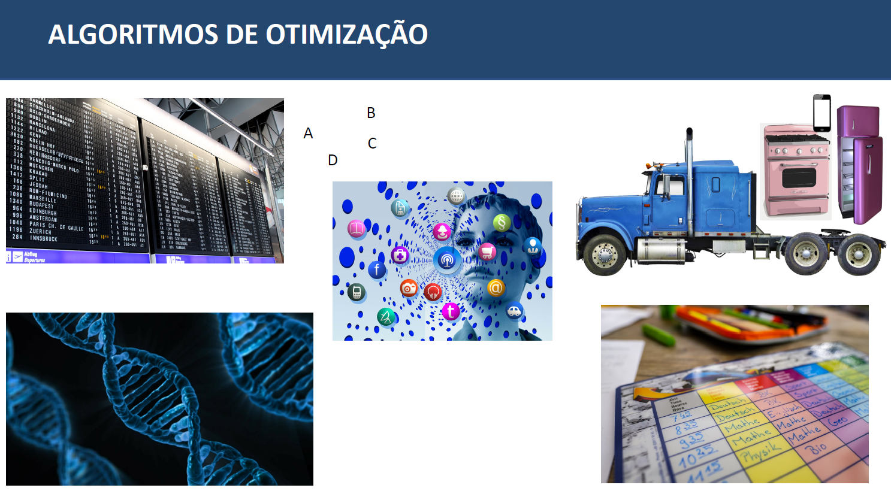
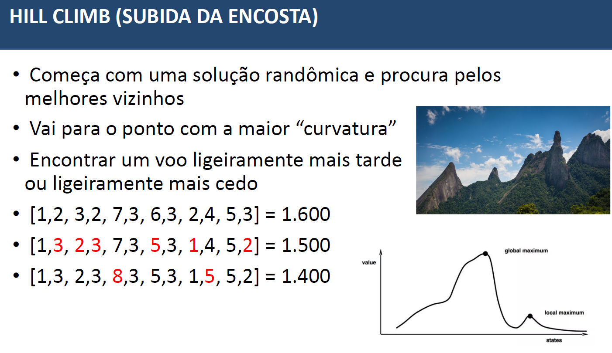
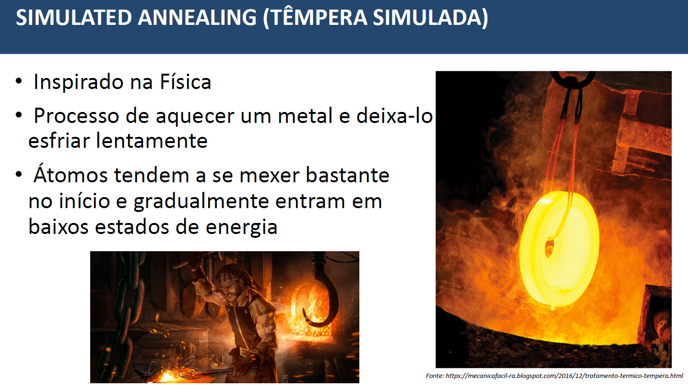
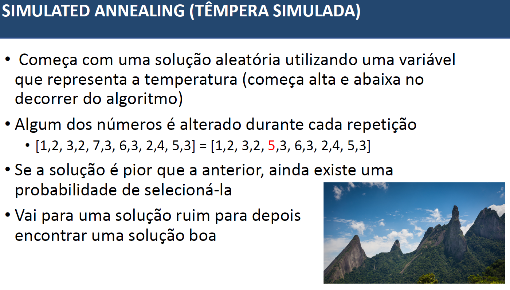
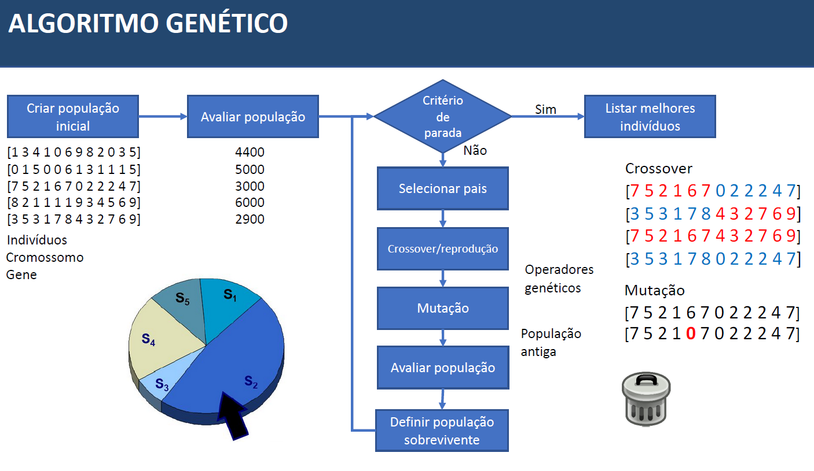

# Algoritmos de Otimização
* Busca maximizar ou minimizar os valores, dessa forma você usa essa combinação de algortimos para chegar no objetivo. Algoritmos de otimização em inteligência artificial são técnicas e métodos projetados para encontrar a melhor solução possível para um problema em um espaço de busca, onde essa solução pode ser um conjunto de parâmetros, uma configuração, uma sequência de ações, ou qualquer outra entidade que precisa ser otimizada de acordo com um critério específico. Esses algoritmos são usados em uma ampla variedade de aplicações, incluindo aprendizado de máquina, planejamento, engenharia, logística, entre outros. Ex: localizar qual a rota de voos e horários mais baratos para uma determinada origem e destino.  

### Hill Climb
* O algoritmo Hill Climbing, também conhecido como subida de encosta, é um algoritmo de busca local usado em inteligência artificial e otimização. Ele é projetado para encontrar uma solução ótima local em um espaço de busca, onde o objetivo é maximizar ou minimizar uma função de custo ou objetivo. No entanto, vale destacar que o Hill Climbing não garante encontrar a solução globalmente ótima, pois ele pode ficar preso em máximos ou mínimos locais.

### Simulated Annealing (Tempera Simulada)
* O Simulated Annealing (ou "têmpera simulada" em português) é um algoritmo de otimização estocástica usado em inteligência artificial e outras áreas para encontrar soluções aproximadamente ótimas para problemas de otimização. O nome do algoritmo é inspirado no processo físico da têmpera de materiais, onde um material é aquecido e depois resfriado lentamente para melhorar sua estrutura. O Simulated Annealing foi introduzido por Kirkpatrick, Gelatt e Vecchi em 1983 e é baseado na ideia de explorar o espaço de busca de maneira probabilística, permitindo que o algoritmo aceite soluções piores em alguns casos, a fim de escapar de mínimos locais e encontrar a solução globalmente ótima (ou uma boa aproximação dela).

### Algoritmo Genetico (AG)
* O algoritmo genético (AG) é uma técnica de otimização e busca inspirada na teoria da evolução darwiniana que faz parte do campo da inteligência artificial. Ele é usado para encontrar soluções aproximadas ou ótimas para problemas de otimização e busca, especialmente em espaços de busca complexos. O algoritmo genético é uma das principais abordagens de otimização baseadas em população.

