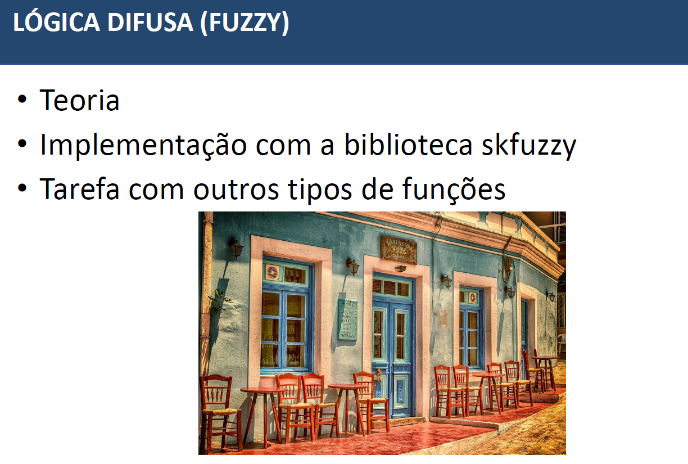
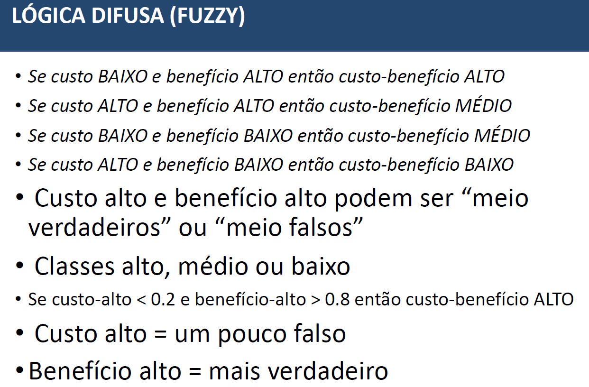
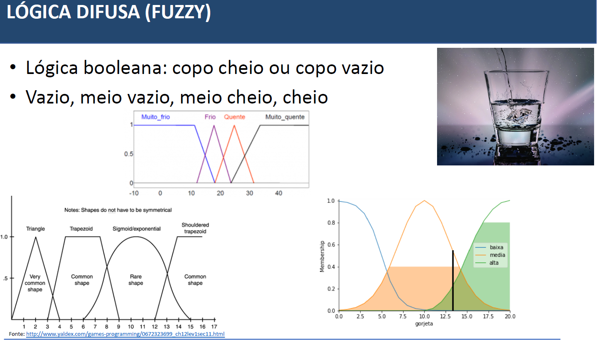

# Lógica Difusa ou Fuzzy
* A lógica difusa, também conhecida como lógica fuzzy, é uma abordagem na inteligência artificial e no processamento de informações que lida com incertezas e imprecisões de forma mais flexível do que a lógica clássica (ou lógica booleana), que é baseada em valores binários (verdadeiro ou falso, 1 ou 0). Na lógica difusa, as variáveis podem assumir valores em um espectro contínuo de verdade ou pertinência, em oposição aos valores booleanos. Em vez de afirmar que uma declaração é verdadeira ou falsa, a lógica difusa permite que uma declaração seja parcialmente verdadeira ou parcialmente falsa. Isso reflete melhor a natureza complexa e imprecisa de muitos problemas do mundo real.

### Exemplos do Mundo Real

