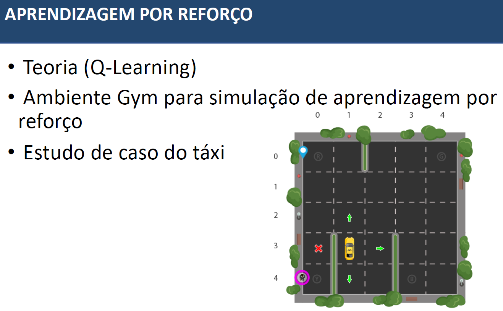
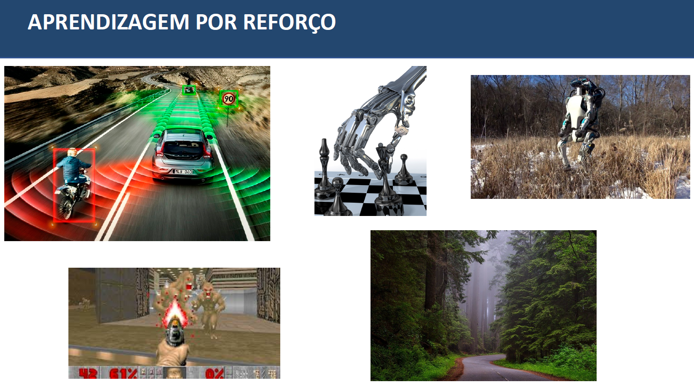
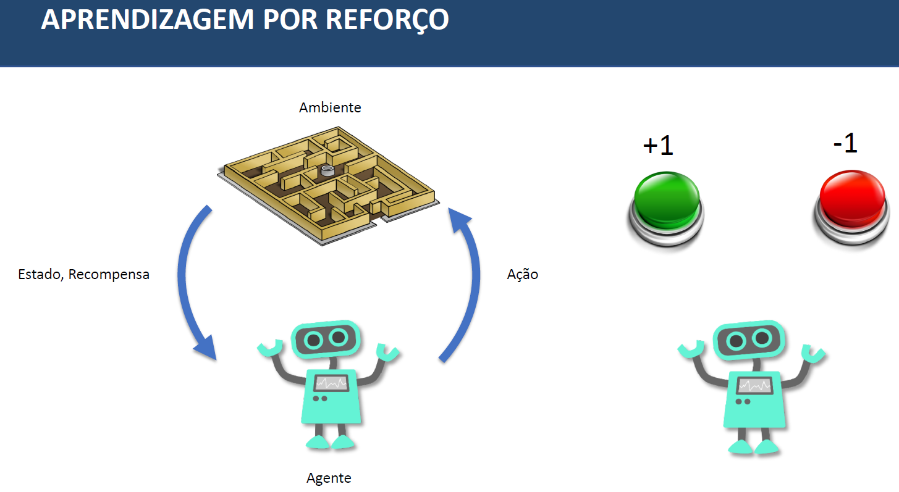
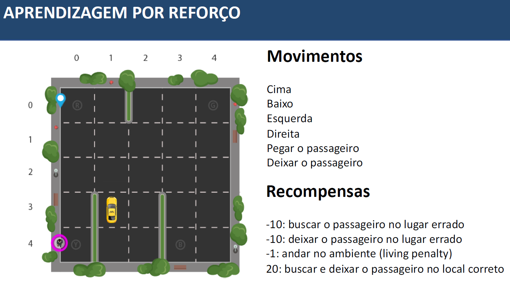
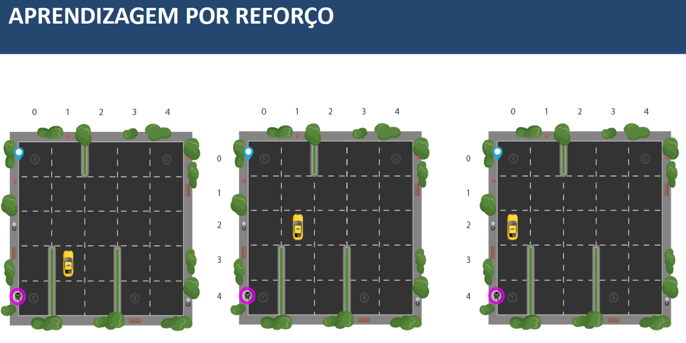
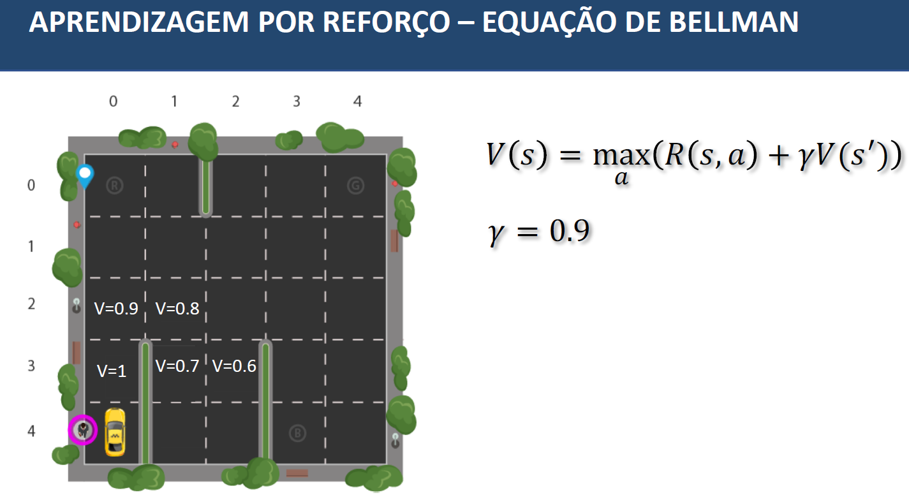
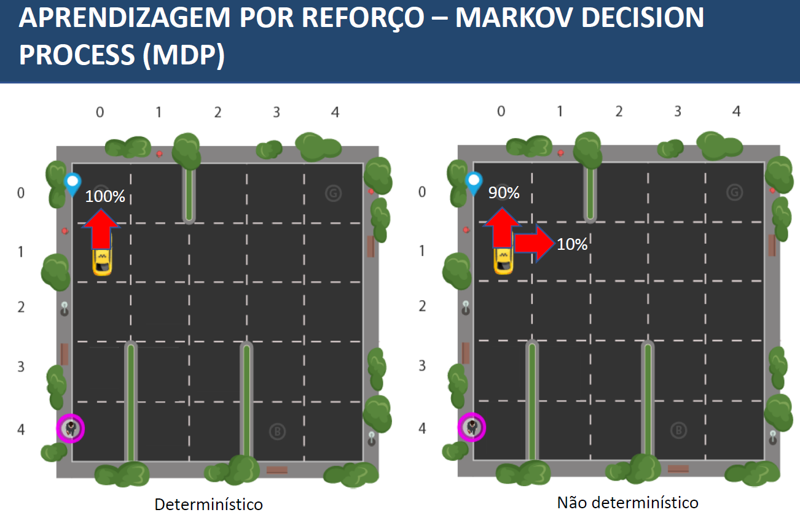
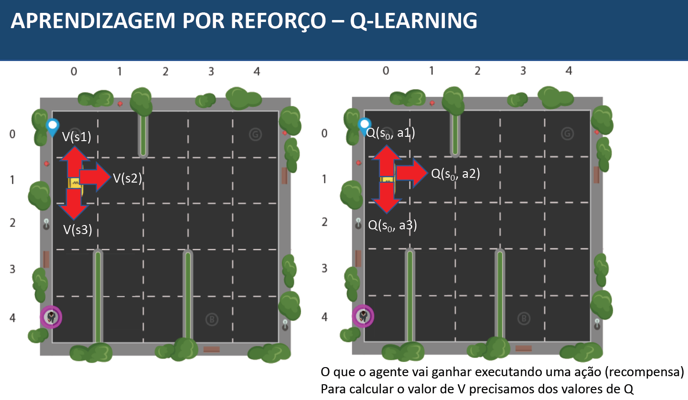
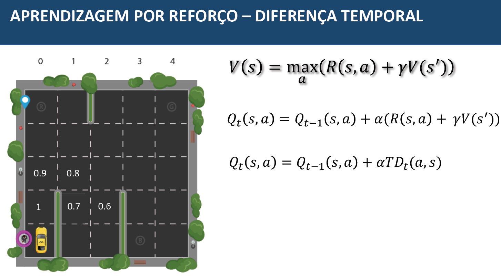

# Método - Aprendizado por Reforço

A aprendizagem por reforço (Reinforcement Learning - RL) é um paradigma de aprendizado de máquina onde um agente interage com um ambiente e aprende a tomar ações sequenciais para maximizar uma recompensa cumulativa ao longo do tempo. O agente toma decisões com base em sua experiência passada e na busca por ações que levem a resultados desejados. O objetivo é aprender uma política de ação que maximize a recompensa ao longo do tempo.
Exemplos:

- Jogos de Vídeo: Treinar agentes de IA para jogar jogos como xadrez, Go, Dota 2 e jogos de plataforma, maximizando a pontuação ou vencendo adversários humanos.

- Robótica Autônoma: Programar robôs para realizar tarefas complexas, como navegar em ambientes desconhecidos, manipular objetos, dirigir carros autônomos e voar drones.

- Sistemas de Recomendação: Desenvolver sistemas de recomendação personalizados, como os usados na Netflix ou Amazon, que recomendam filmes, produtos e músicas aos usuários.

- Controle de Processos Industriais: Otimizar o controle de processos em indústrias, como química e manufatura, para maximizar a produção e minimizar o consumo de recursos.

- Medicina: Personalizar tratamentos médicos para pacientes com base em suas respostas individuais, otimizando a terapia.

- Navegação de Veículos Não Tripulados (Drones): Ensinar drones a navegar em ambientes complexos, evitando obstáculos e atingindo destinos com eficiência.

- Treinamento de Agentes Virtuais: Desenvolver personagens virtuais em jogos para agir de forma mais realista e desafiadora.

- Gerenciamento de Portfólio Financeiro: Otimizar investimentos financeiros para maximizar o retorno com base nas condições do mercado.

- Controle de Tráfego e Transporte: Gerenciar eficientemente o tráfego de veículos e o planejamento de rotas para minimizar o congestionamento.

- Aprendizado por Robôs no Mundo Real: Treinar robôs no mundo real para realizar tarefas como montagem de produtos, entrega de pacotes ou manutenção de equipamentos.

## Exemplo usando o modelo do Taxi
O ambiente "Taxi" é um dos ambientes de simulação disponíveis no pacote OpenAI Gym, que é amplamente utilizado para treinar e testar algoritmos de aprendizado por reforço. Este ambiente é frequentemente usado como um problema de exemplo para ilustrar como a aprendizagem por reforço pode ser aplicada. Vou explicar os principais elementos do ambiente "Taxi" a seguir:

Nome do ambiente: "Taxi-v3"

Objetivo: O objetivo do ambiente "Taxi" é treinar um agente (um táxi) para pegar um passageiro em uma posição específica e deixá-lo em seu destino em um grid (grade) 2D. O agente deve aprender a navegar pelo grid, escolhendo ações para pegar e deixar passageiros em locais corretos, minimizando o tempo e o custo total de suas ações.

