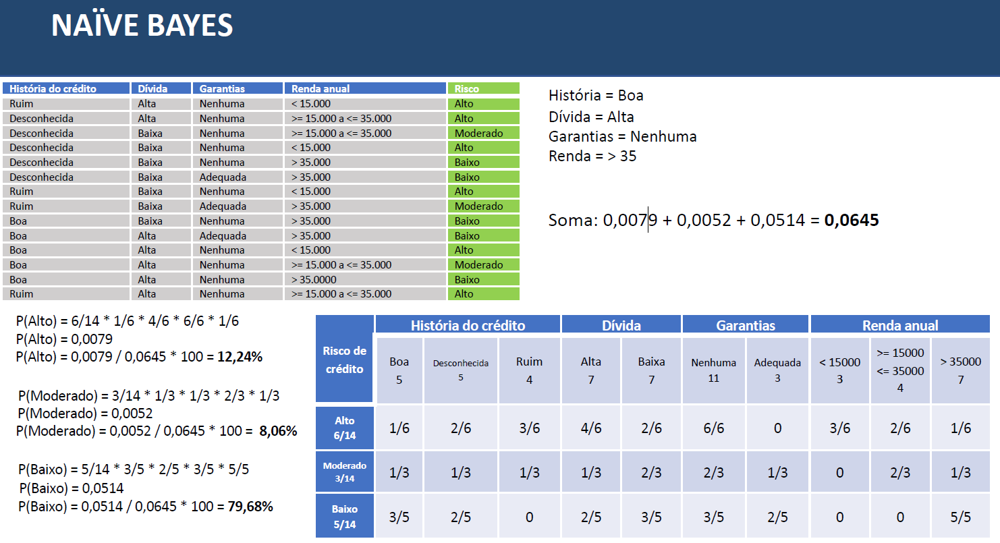
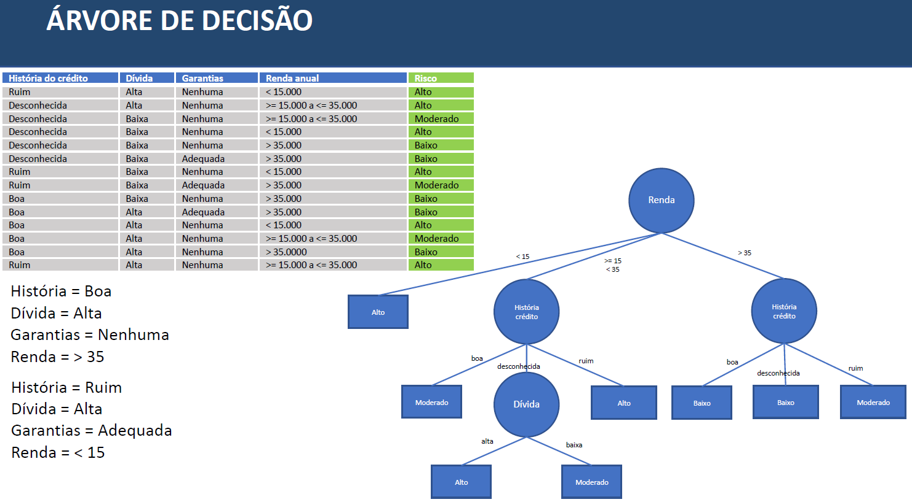
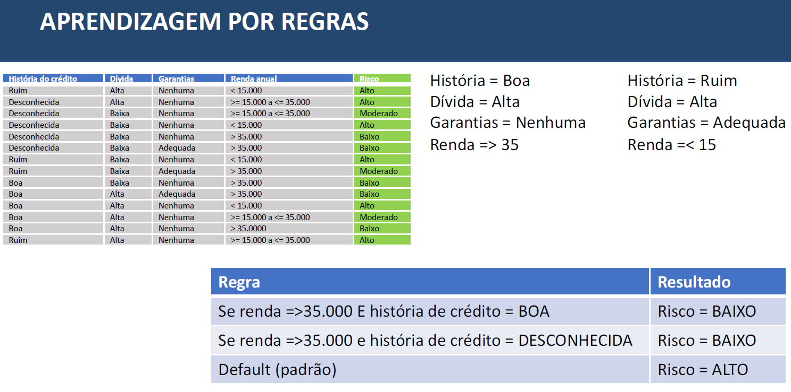
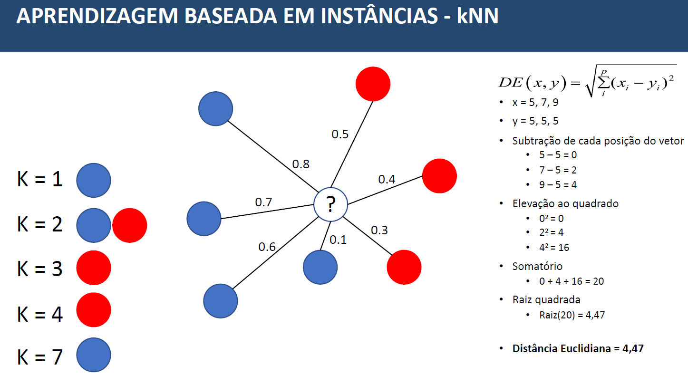
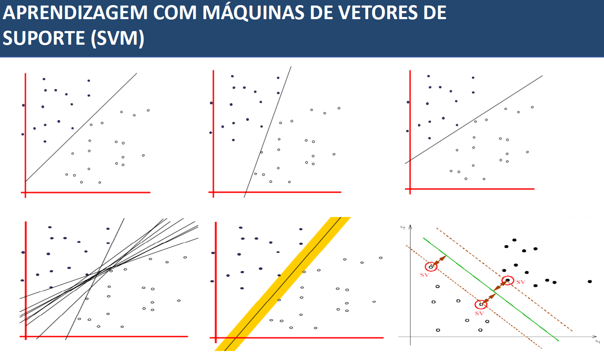
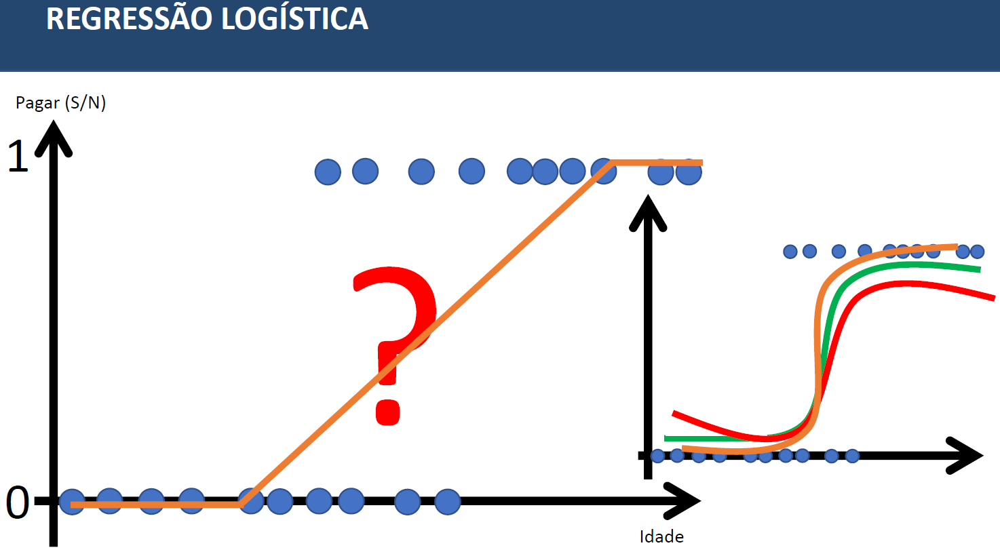
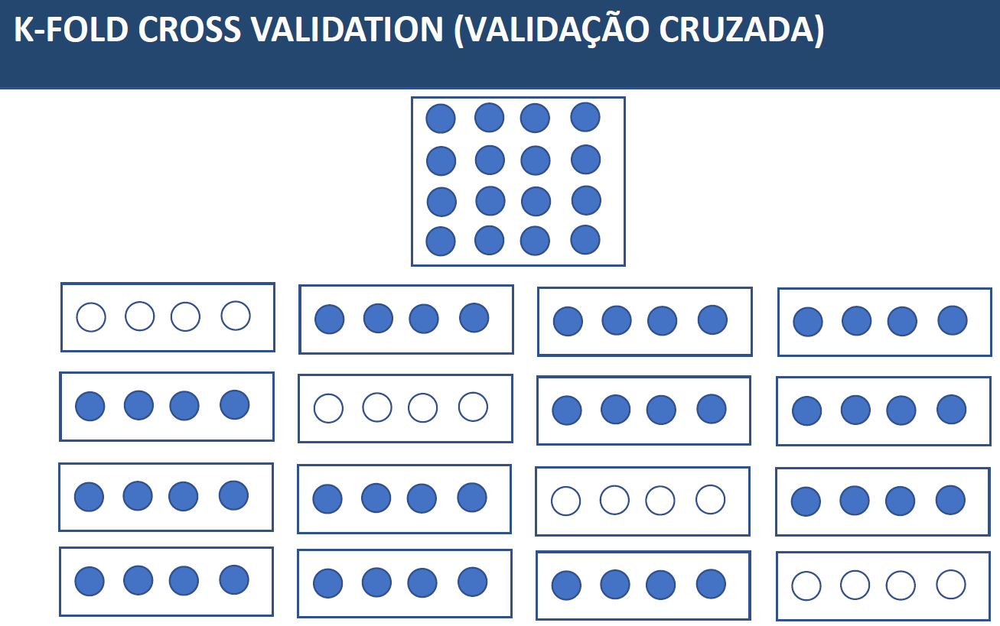

# Método - Classificação 
* Fazer  previsão baseado em dados históricos, vai buscar realizar a classificação dos dados utilizando o aprendizado de máquina
Ex: Histórico de clientes realizando a classificação dos cliente devido ao risco (alto, moderado, baixo)

### Naive Bayes
* O algoritmo faz uma aprendizagem de todos os dados e gera uma tabela de probabilidade fazendo uma contagem e cruzamento com as propriedades. Os dados para testes são aplicados na tabela gerada para classificar o registro.

### Arvore de Decisão (Tree)
* O algoritmo faz cálculos matemáticos para gerar a arvore de decisão com as propriedades. Os dados para testes são aplicados na arvore de decisão para classificar o registro.

### Aprendizagem por Regras (CN2 Rule Induction)
* O algoritmo faz cálculos estatisticos para retornar as regras. Os dados para testes são aplicados nas regras para classificar o registro.

### Aprendizagem Baseada em Instâncias (kNN) - Os Vizinhos mais Próximos
* O algoritmo faz cálculos matemáticos para retornar os vizinhos mais próximos, aonde o K vai determinar a quantidade de vizinhos desejados, essa distância entre os registros é calculada pela formula euclidiana, podem ser usadas outras formulas. Os dados para testes são calculados a sua distancia para encontrar o registro mais proximo e classificar.

### Aprendizagem com Máquinas de Vetores de Suporte (SVM)
* O algoritmo faz cálculos matematicos para buscar as linhas com margem maxima entre os pontos. Os dados para testes são calculados a sua linha utilizando so vetores de suporte para classificar o registro.

### Regressão Logistica (Logistic Regression)
* Algoritmos de regressão normalmente trabalha com previsão de números, porém a regressao logistica serve para classificar, o algoritmo faz cálculos matematicos para buscar um S no gráfico em vez de uma linha reta, assim ela aborda todos os dados, o objetivo é encontrar a melhor linha que toca o maximo de pontos. Os dados para testes são calculados a sua linha utilizando o "S" para classificar o registro.

## Testes 
* Os testes para os algoritmos estavam usando a tecnica de dividir a base de dados em 80% para o treino e 20% para realizar os testes, porém existem uma tecnica mais eficiente chamada K-Fold Cross Validation.
* K-Fold Cross Valation (Validacao Cruzada): O "K" é definido para sabar quantas divisoes serao feitas na base de dados, em geral os trabalhos cientificos usam o "K=10", ou seja divide a sua base em 10 pedacos, em seguida é usado um slot para fazer os teste e os outros 9 slots é usado para criar o modelo, na sequencia ele vai fazer o teste com outro slot e o modelo com os outros 9 slots seguindo assim ate que todos os slots sejam testados 

