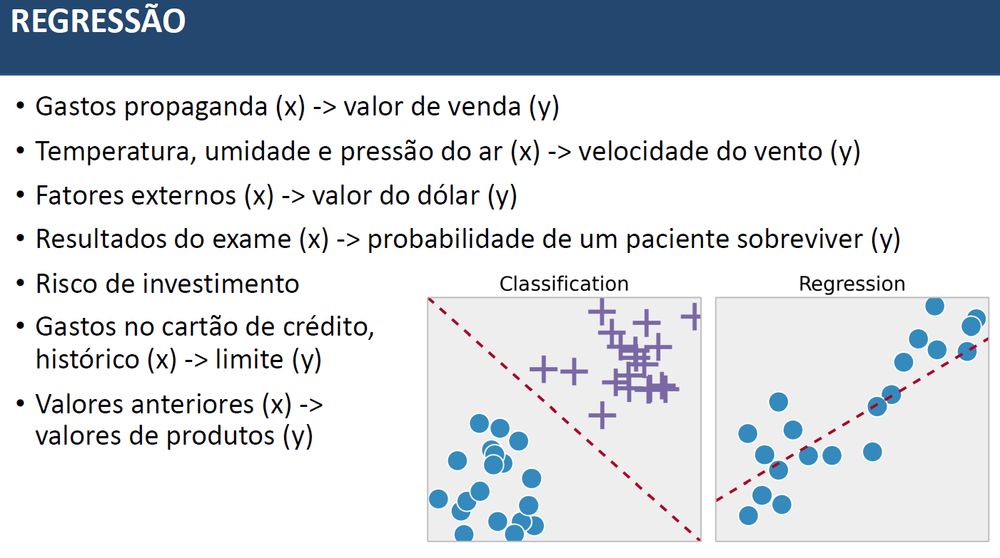
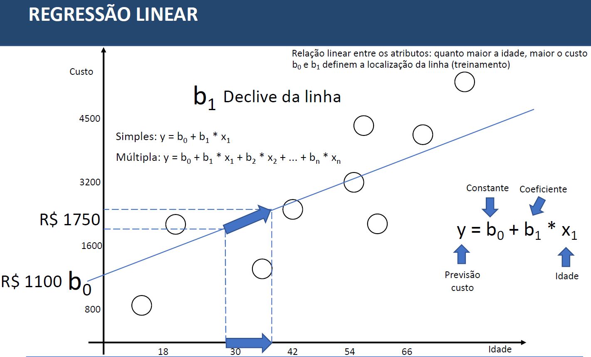

# Método - Regressão
* Fazer  previsão baseado em dados históricos, vai buscar realizar a previsão baseada nos números dos dados utilizando o aprendizado de máquina
Ex: Previsão do valor de vendas baseado nos gastos de propaganda, baseado nos fatores externos fazer previsao do dolar, baseado no gastos no cartao de credito e historico fazer a previsao do novo limite.

### Regressão Linear
* O algoritmo faz uma aprendizagem de todos os dados e busca encontrar uma relação linear entre os atributos. Os dados para testes são calculados para encontrar a previsao.

